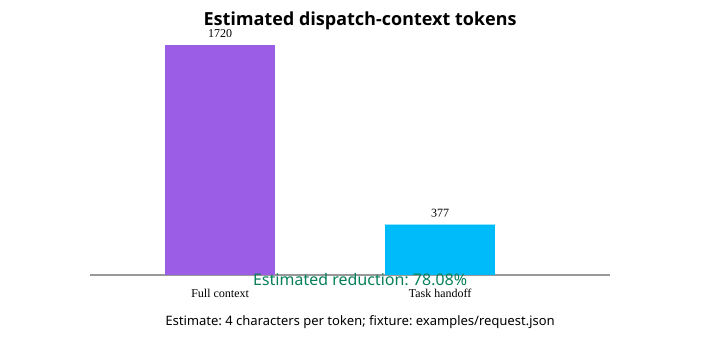

# model-effort-router

[English](README.md) | 日本語

「model-effort-router」は、入力された依頼から候補となるタスクDAGを選び、
各タスクへ利用可能な(model, effort)の組み合わせを割り当てます。
Python 3.11+、標準ライブラリのみで動作するライブラリ／CLIです。

このルーターは、どのAIオーケストレーターからも利用できるように、
モデル一覧、effort値、能力、タスク要件、実行層を呼び出し側から受け取ります。
ルーター自身は計画を選択するだけで、モデルプロバイダーを呼び出したり、
タスクを実行したりしません。

## 状態と範囲

- **Alpha:** 入出力契約は小さく、1.0までに変更される可能性があります。
- **ベンチマーク非掲載:** JevまたはTypeSafeの性能比較・ベンチマークは公開しません。
- **TypeSafe連携は非公式:** TypeSafeとの提携、承認、サポートを意味しません。
- Choice応答形式は
  [TypeSafe公式Choice仕様](https://docs.typesafe.ai/primitives/choice)に基づきます。
  公開された合成データでライブ互換性を検証済みですが、実際のホストdispatchと
  プロバイダー能力の検出は呼び出し側の責務です。

## 入力契約

CLIへJSONを渡します。

~~~
{
  "request": "サービスへ監査ログを追加する",
  "constraints": {
    "language": "Python",
    "public_api": "stable"
  },
  "candidates": [
    {
      "id": "small-change",
      "description": "分離された変更を実装してテストする",
      "tasks": [
        {
          "id": "implement",
          "description": "監査ログを実装する",
          "depends_on": [],
          "requirements": ["python"],
          "allowed_pairs": [
            {"model": "gpt-5.6-terra", "effort": "high"}
          ]
        }
      ]
    }
  ],
  "models": [
    {
      "id": "gpt-5.6-terra",
      "provider": "openai",
      "efforts": ["low", "medium", "high"],
      "capabilities": ["python"],
      "description": "一般的な実装モデル"
    }
  ],
  "max_parallel": 1
}
~~~

constraints、タスクのrequirementsとallowed_pairs、モデルのcapabilitiesと
descriptionは省略できます。constraintsはJSONオブジェクトです。
候補内のタスクはdepends_onによるDAGを構成し、依存先は同じ候補内のタスクIDで
指定します。allowed_pairsは{ "model": "...", "effort": "..." }形式です。

~~~powershell
python -m pip install -e .
python -m model_effort_router examples/request.json
~~~

ルーターは次の2段階で選択します。

1. 分解候補を選択する
2. 選択した候補の各タスクへ、許可されたmodel／effortを割り当てる

返されるJSONは外部スケジューラーに渡せます。depends_onとmax_parallelの
強制、および実際のタスク実行はスケジューラーが担当します。

## Portable agent skill

プロバイダーに依存しないスキルは
[skill/model-effort-router/SKILL.md](skill/model-effort-router/SKILL.md)にあります。
エージェントホストから直接読み込むか、skill/model-effort-routerディレクトリ全体を
ホストのスキルディレクトリへコピーしてください。references/とexamples/への
相対リンクを保つため、ディレクトリ構造は維持してください。

Codex、Claude、Gemini、汎用オーケストレーター向けの対応例は
[references/adapters.md](skill/model-effort-router/references/adapters.md)に分離しています。
中核ワークフローとJSON契約は特定プロバイダーに依存しません。

## トークン削減の測定

再現可能なfixtureで、workerごとのdispatch contextを測定できます。これは
プロバイダーの課金、レイテンシー、品質、モデル性能の測定ではありません。

~~~powershell
python scripts/measure_token_reduction.py examples/request.json --json-out docs/token-reduction-results.json --svg-out docs/token-reduction.svg
~~~

付属fixtureでは、全体コンテキスト方式が**推定1,720トークン**、
タスクhandoff方式が**推定377トークン**でした。差は**1,343トークン
(78.08%)**です。これは4文字を1トークンとする透明な近似であり、
プロバイダーのtokenizerや性能を示すものではありません。

## Jevモードとプライバシー

TYPESAFE_API_KEYがない場合は**framework-only／dry-runモード**です。
分解と割当のChoice payloadを出力し、外部通信は行いません。Jevが呼ばれたとは
扱いません。

TYPESAFE_API_KEYがあり、--dry-runを指定しない場合は、TypeSafeへ最小限の
ルーティング状態を送ります。1回目で分解候補を選び、confidence policyを通過した
場合に2回目でタスクごとのmodel／effortを選びます。キーがあっても通信を止める
場合は--dry-runを使ってください。

キーを入力JSON、ソースコード、ログへ書き込まないでください。認証情報、個人情報、
非公開ソース、リポジトリ全体などをTypeSafeへ送らないでください。

不明、不正、または不完全な応答はfail closedで扱います。推測で選択せず、
エラーまたはneeds_reviewとして返します。

既定のconfidence閾値0.5は保守的な設定値であり、校正済みの正確性を示すものでは
ありません。閾値未満の選択はneeds_reviewとなり、割当は返されません。

## 開発

~~~powershell
python -m unittest discover -s tests -v
~~~

貢献方法は[CONTRIBUTING.md](CONTRIBUTING.md)、セキュリティ報告は
[SECURITY.md](SECURITY.md)を参照してください。

## ライセンス

[Apache-2.0](LICENSE)で公開しています。
